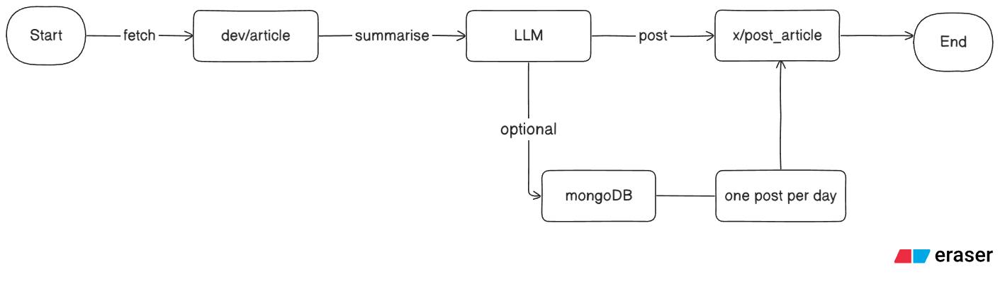
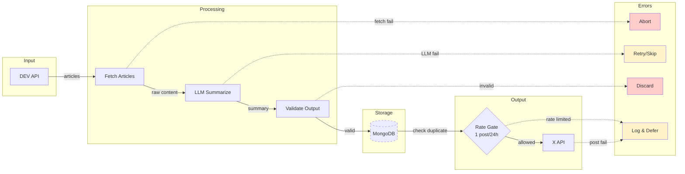

# X Article Automation


**Automated pipeline that fetches developer articles from DEV, summarizes them via LLM and publishes daily posts to X.**

---

## Table of Contents

- [Overview](#overview)
- [Architecture](#architecture)
- [Tech Stack](#tech-stack)
- [Third-Party APIs](#third-party-apis)
- [Prerequisites](#prerequisites)
- [Getting Started](#getting-started)
- [Environment Variables](#environment-variables)
- [Features](#features)
- [Error Handling](#error-handling)
- [License](#license)
- [Author](#author)

---

## Overview

Developer content is abundant. Distribution is not.

This service reduces long form DEV articles into short, compliant posts suitable for X, while respecting API constraints, rate limits, and operational safety.

**Key Objectives:**

- Pull articles from the DEV (Forem) API
- Summarize content using an LLM with enforced character limits
- Optionally persist data to MongoDB for deduplication and retry
- Enforce strict **1 post per 24h** rate limiting
- Publish summaries to X via the X API

> **Note:** Built for backend execution only — cron, workers, serverless jobs. No browser. No UI.

---

## Architecture



<details>
<summary>View detailed flow diagram</summary>



</details>

| Stage      | Description                                      |
|------------|--------------------------------------------------|
| **Fetch**  | Pull articles from DEV API (open/authenticated) |
| **Summarize** | LLM generates X compatible summary           |
| **Persist** | (Optional) Store article + summary in MongoDB  |
| **Rate Gate** | Enforce daily post limit                     |
| **Publish** | Post summary to X                              |

---

## Tech Stack

| Technology | Purpose                          |
|------------|----------------------------------|
| **Node.js** | Runtime environment             |
| **Express** | Backend framework               |
| **MongoDB** | Optional persistence layer      |
| **Mongoose** | MongoDB ODM                    |

---

## Third-Party APIs

| API | Usage | Documentation |
|-----|-------|---------------|
| **DEV / Forem API** | Fetch developer articles | [docs.forem.com](https://developers.forem.com/api) |
| **X API** | Publish posts to X (Twitter) | [developer.x.com](https://developer.x.com/en/docs) |
| **LLM Provider** | Generate article summaries (provider agnostic) | — |

---

## Prerequisites

Before running this project, ensure you have the following installed:

- **Node.js** v18.0.0 or higher
- **npm** v9.0.0 or higher
- **MongoDB** (optional, for persistence)
- **DEV API Key** (for authenticated endpoints)
- **X API Key** (required for posting)

---

## Getting Started

**1. Clone the repository**

```bash
git clone https://github.com/ajajm/x-post-automation.git
cd x-post-automation
```

**2. Install dependencies**

```bash
cd backend
npm install
```

**3. Configure environment variables**

```bash
cp .env.example .env
# Edit .env with your API keys
```

**4. Run the application**

```bash
npm start
```

---

## Environment Variables

Create a `.env` file in the `backend` directory:

```env
# DEV API (required for authenticated endpoints)
DEV_TO_API_KEY=your_dev_api_key

# X API (required)
X_API_KEY=your_x_api_key
X_API_SECRET=your_x_api_secret
X_ACCESS_TOKEN=your_x_access_token
X_ACCESS_SECRET=your_x_access_secret

# MongoDB (optional)
MONGODB_URI=mongodb://localhost:27017/x-post-automation

# Server
PORT=3000
```

> ⚠️ **Never commit secrets to source control.**

---

## Features

- **Article Fetching** — Pull latest articles from DEV API
- **LLM Summarization** — Generate concise, X compatible summaries
- **Rate Limiting** — Strict 1 post per 24h enforcement
- **Deduplication** — Prevent reposting of processed articles
- **Retry Logic** — Handle transient failures gracefully
- **Stateless Mode** — Run without database when persistence isn't needed

---

## Error Handling

| Stage | Behavior |
|-------|----------|
| DEV fetch fails | Abort cycle |
| LLM fails | Skip article or retry |
| Validation fails | Discard output |
| X post fails | Log and defer |

No partial or corrupt state is published.

---

## License

This project is licensed under the **MIT License** — see the [LICENSE](LICENSE) file for details.

---

## Author

**ajaj**

- GitHub: [@ajajm](https://github.com/ajajm)
- Website: [ajaj.dev](https://ajaj.dev)

---

<p align="center">
  <i>Automation should be boring, predictable, and constrained.</i>
</p>
